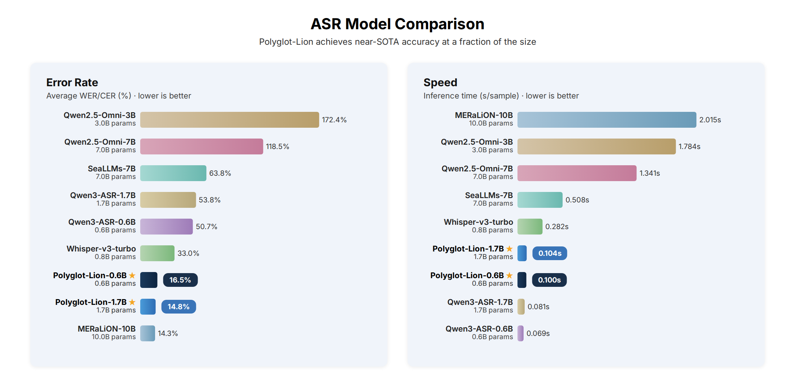
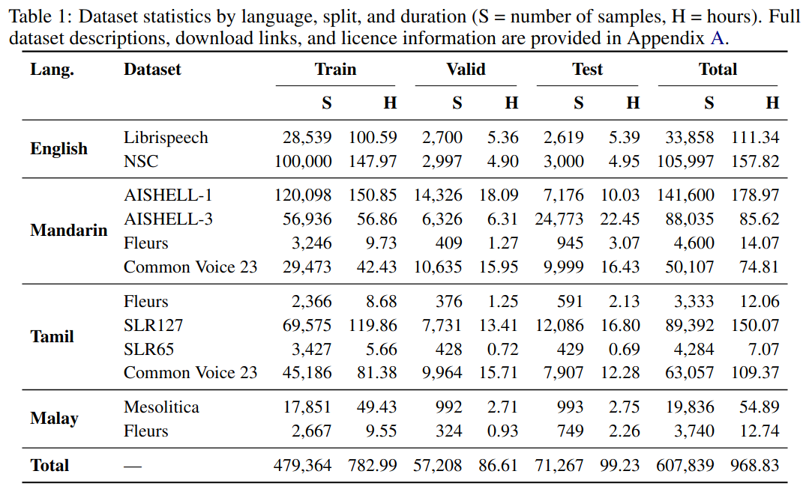

<div align="center">

## [Polyglot-Lion: Efficient Multilingual ASR for Singapore via Balanced Fine-Tuning of Qwen3-ASR](https://arxiv.org/abs/2603.16184)

[](https://knoveleng.github.io/polyglot-lion/)
[](https://arxiv.org/abs/2603.16184)
[](https://huggingface.co/knoveleng)
[](https://www.python.org/)

**polyglot-lion** (*poly* = many · *glot* = tongue/language · *lion* = Lion City, Singapore) is a family of compact, high-performance multilingual Automatic Speech Recognition (ASR) models, developed by [Knovel Engineering](https://github.com/knoveleng), supporting **English**, **Mandarin**, **Tamil**, and **Malay** — trained on a **single consumer GPU** for under **$81**.

</div>

---

## ✨ Highlights

- 🏆 **State-of-the-art accuracy** among models of similar size across 4 languages and 14 benchmark datasets
- 💰 **$81 training cost** — 233× cheaper than comparable multilingual ASR systems (vs. $18,862 for MERaLiON-2-10B-ASR)
- 🖥️ **Single GPU training** on 1× NVIDIA RTX PRO 6000 in 48 hours
- ⚡ **Fast inference** — ~0.10 s/sample on a single NVIDIA RTX PRO 4500 GPU
- 📦 **Compact models** — 0.6B and 1.7B parameters, easily deployable on edge devices
- 🔄 **Two-stage balanced upsampling** algorithm for multilingual data balancing

---

## 📊 Results

### ASR Evaluation

Polyglot-Lion achieves competitive or best-in-class Word Error Rate (WER) and Character Error Rate (CER) across all four languages, outperforming models up to **6× larger**.

<div align="center">

</div>

<details>
<summary><b>Full benchmark results (click to expand)</b></summary>

| Model | Params | English (LS) | English (NSC) | Mandarin (CV) | Mandarin (AISH1) | Mandarin (AISH3) | Mandarin (Fleurs) | Tamil (CV) | Tamil (SLR65) | Tamil (SLR127) | Tamil (Fleurs) | Malay (Meso.) | Malay (Fleurs) | **Avg** |
|:---|:---:|:---:|:---:|:---:|:---:|:---:|:---:|:---:|:---:|:---:|:---:|:---:|:---:|:---:|
| Whisper-large-v3-turbo | 0.8B | 3.04 | 32.02 | 17.91 | 9.64 | 16.81 | 10.63 | 74.50 | 58.13 | 69.56 | 66.90 | 28.47 | 8.88 | 33.04 |
| SeaLLMs-Audio-7B | 7B | 94.74 | 9.53 | 8.68 | 9.65 | 9.76 | 37.09 | 126.70 | 127.24 | 138.65 | 105.31 | 71.34 | 26.25 | 63.75 |
| Qwen2.5-Omni-3B | 3B | 29.21 | 34.79 | 46.36 | 28.25 | 44.55 | 54.74 | 318.36 | 465.58 | 448.82 | 311.67 | 211.90 | 74.69 | 172.37 |
| Qwen2.5-Omni-7B | 7B | 13.80 | 22.96 | 14.49 | 7.33 | 22.58 | 16.68 | 252.06 | 239.15 | 303.96 | 326.43 | 158.06 | 43.92 | 118.45 |
| Qwen3-ASR-0.6B | 0.6B | 2.74 | 7.64 | 10.06 | 2.08 | 2.59 | 9.75 | 121.10 | 127.00 | 129.12 | 130.09 | 47.29 | 18.71 | 50.68 |
| Qwen3-ASR-1.7B | 1.7B | 2.31 | 6.22 | 7.50 | 1.52 | 2.08 | 9.33 | 139.96 | 134.63 | 144.49 | 147.23 | 39.00 | 10.87 | 53.76 |
| MERaLiON-2-10B-ASR | 10B | 2.54 | **4.62** | 8.83 | 3.09 | 4.07 | 11.99 | **31.78** | **19.29** | **22.42** | **28.68** | 25.90 | **8.55** | **14.32** |
|  |  |  |  |  |  |  |  |  |  |  |  |  |  |
| **Polyglot-Lion-0.6B** | 0.6B | 2.67 | 6.09 | 6.16 | 1.93 | 2.32 | 9.19 | 42.16 | 23.07 | 28.14 | 37.68 | 24.33 | 14.45 | 16.52 |
| **Polyglot-Lion-1.7B** | 1.7B | **2.10** | 5.28 | **4.91** | **1.45** | **1.86** | **8.00** | 39.19 | 19.75 | 26.83 | 37.28 | **21.51** | 9.98 | 14.85 |

*WER (%) for English, Tamil, and Malay; CER (%) for Mandarin. Lower is better.*
*Bold = best overall; results with WER > 200% excluded from average.*

</details>

### Training Cost

Polyglot-Lion achieves comparable quality at a **fraction of the cost**:

|  | MERaLiON-2-10B-ASR | Polyglot-Lion |
|:---|:---:|:---:|
| Training Data | 120,000 h | 783 h |
| Hardware | 128 × H100 | 1 × RTX PRO 6000 |
| Training Time | 48 h | 48 h |
| **Est. Cost** | **$18,862** | **$81** |

### Inference Latency

| Model | Time (s/sample) |
|:---|:---:|
| MERaLiON-2-10B-ASR | 2.0152 ± 0.8846 |
| Qwen2.5-Omni-3B | 1.7838 ± 1.0431 |
| Qwen2.5-Omni-7B | 1.3414 ± 0.6572 |
| SeaLLMs-Audio-7B | 0.6422 ± 0.0000 |
| Whisper-large-v3-turbo | 0.2822 ± 0.0230 |
| Qwen3-ASR-1.7B | 0.0809 ± 0.0290 |
| Qwen3-ASR-0.6B | 0.0686 ± 0.0251 |
| **Polyglot-Lion-0.6B** | 0.0999 ± 0.0561 |
| **Polyglot-Lion-1.7B** | 0.1038 ± 0.0621 |

*Measured on a single NVIDIA RTX PRO 4500 GPU. Lower is better.*

---

## 🔧 Method

### Two-Stage Balanced Multilingual Upsampling

To handle severe class imbalance across languages and datasets, we introduce a **two-stage balanced upsampling** strategy:

1. **Stage 1 — Intra-language balancing:** Within each language, smaller datasets are replicated and subsampled to match the largest dataset in that language.
2. **Stage 2 — Inter-language balancing:** Across languages, per-language corpora are balanced so every language contributes equally to the final training set.

### Training Data

We curate a multilingual corpus spanning **4 languages**, **12 datasets**, and **~969 hours** of audio:

<div align="center">

</div>

---

## 🤗 Models

| Model | Parameters | HuggingFace |
|:---|:---:|:---:|
| Polyglot-Lion-0.6B | 0.6B | [knoveleng/polyglot-lion-0.6b](https://huggingface.co/knoveleng/polyglot-lion-0.6b) |
| Polyglot-Lion-1.7B | 1.7B | [knoveleng/polyglot-lion-1.7b](https://huggingface.co/knoveleng/polyglot-lion-1.7b) |

---

## 🚀 Quick Start

Polyglot-Lion is built on the [Qwen3-ASR](https://github.com/QwenLM/Qwen3-ASR) architecture and uses the `qwen-asr` package for both inference and fine-tuning.

### Installation

```bash
# Install uv (if not already installed)
curl -LsSf https://astral.sh/uv/install.sh | sh

# Create a clean environment (recommended)
uv venv --python 3.12
source .venv/bin/activate

# Install qwen-asr (transformers backend)
uv pip install qwen-asr hf_transfer

# Optional: install vLLM backend for faster inference
uv pip install "qwen-asr[vllm]" hf_transfer

# Optional but recommended: install FlashAttention 2
# uv pip install flash-attn --no-build-isolation
```

### Inference

#### Transformers Backend

```python
import torch
from qwen_asr import Qwen3ASRModel

model = Qwen3ASRModel.from_pretrained(
    "knoveleng/polyglot-lion-1.7b",
    dtype=torch.bfloat16,
    device_map="cuda:0",
    # attn_implementation="flash_attention_2",
    max_new_tokens=256,
)

results = model.transcribe(
    audio="path/to/audio.wav",
    language=None,  # auto-detect, or set "English", "Chinese", "Tamil", "Malay"
)

print(results[0].language)
print(results[0].text)
```

#### vLLM Backend (faster)

```python
import torch
from qwen_asr import Qwen3ASRModel

if __name__ == "__main__":
    model = Qwen3ASRModel.LLM(
        model="knoveleng/polyglot-lion-1.7b",
        gpu_memory_utilization=0.7,
        max_new_tokens=4096,
    )

    results = model.transcribe(
        audio=["audio1.wav", "audio2.wav"],
        language=None,
    )

    for r in results:
        print(r.language, r.text)
```

For more details on inference options (batch, timestamps, streaming, server deployment), see the [Qwen3-ASR documentation](https://github.com/QwenLM/Qwen3-ASR).

---

## 🎯 Fine-tuning

Polyglot-Lion can be fine-tuned on your own data using the Qwen3-ASR fine-tuning pipeline. For the full guide — including data format, single/multi-GPU training, and resuming from checkpoints — see the [Qwen3-ASR fine-tuning documentation](https://github.com/QwenLM/Qwen3-ASR/tree/main/finetuning).

---

## 📏 Evaluation

We use [asr-evalkit](https://github.com/knoveleng/asr-evalkit) — a modular toolkit for evaluating ASR models — to benchmark Polyglot-Lion.

### Setup

```bash
git clone https://github.com/knoveleng/asr-evalkit.git
cd asr-evalkit

uv venv asr --python 3.12
source asr/bin/activate

uv pip install -e .
uv pip install vllm  # required for Polyglot-Lion (qwen3_asr evaluator)
```

### Run Evaluation

```bash
asr-evalkit \
  --evaluator qwen3_asr \
  --model knoveleng/polyglot-lion-1.7b \
  --dataset openslr/librispeech_asr \
  --dataset-config clean \
  --dataset-split test \
  --streaming \
  --audio-column audio \
  --text-column text \
  --output-file results.json
```

For additional evaluators, datasets, and Python API usage, see the [asr-evalkit documentation](https://github.com/knoveleng/asr-evalkit).

---

## 📝 Citation

If you find Polyglot-Lion useful in your research, please cite:

```bibtex
@misc{dang2026polyglotlion,
      title={Polyglot-Lion: Efficient Multilingual ASR for Singapore via Balanced Fine-Tuning of Qwen3-ASR}, 
      author={Quy-Anh Dang and Chris Ngo},
      year={2026},
      eprint={2603.16184},
      archivePrefix={arXiv},
      primaryClass={cs.CL},
      url={https://arxiv.org/abs/2603.16184}, 
}
```

---
